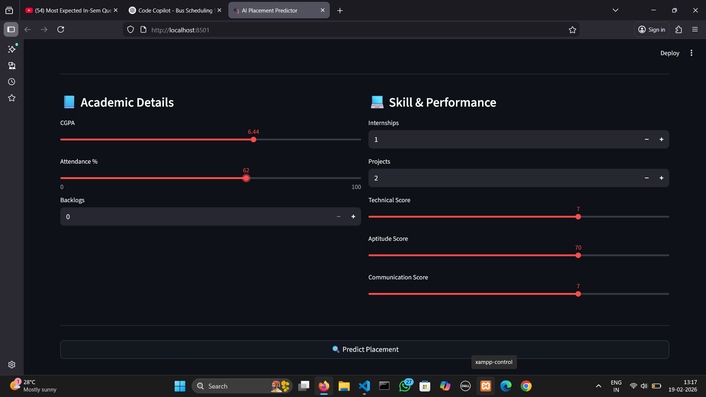
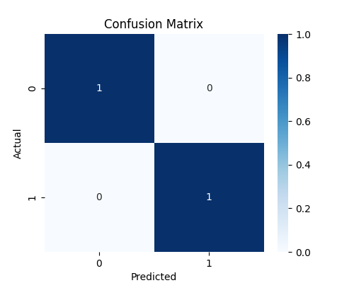
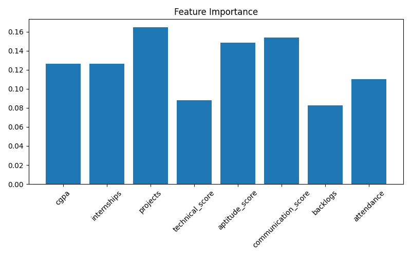

# 🎓 AI Student Placement Predictor

An end-to-end Machine Learning web application that predicts whether a student will get placed based on academic performance, skills, and key performance indicators.

## 📌 Project Overview

This project uses supervised machine learning algorithms to predict student placement outcomes.

The system:

- Takes academic and skill parameters as input
- Compares multiple classification models
- Selects the best-performing model
- Displays placement probability
- Visualizes model evaluation metrics
- Provides an interactive web interface

This project demonstrates practical implementation of machine learning in real-world academic analytics.

---

## 🧠 Machine Learning Approach

### Models Implemented

- Random Forest Classifier
- Logistic Regression

### Evaluation Metrics

- Accuracy
- Precision
- Recall
- F1-Score
- Confusion Matrix

### Model Performance

- Achieved **85%+ Accuracy** (depending on dataset size)
- Random Forest selected as best-performing model

---

## 📊 Features Used for Prediction

- CGPA
- Number of Internships
- Number of Projects
- Technical Skill Score
- Aptitude Score
- Communication Score
- Number of Backlogs
- Attendance Percentage

---

## 📷 Screenshots

### 🖥 Premium User Interface

### 📈 Confusion Matrix

### 📊 Feature Importance

---
